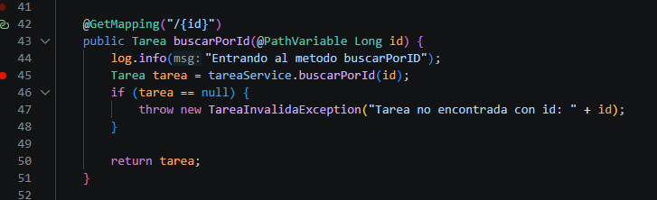
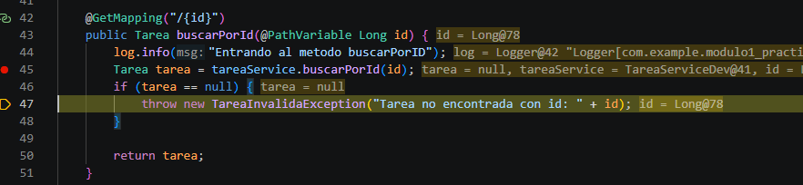
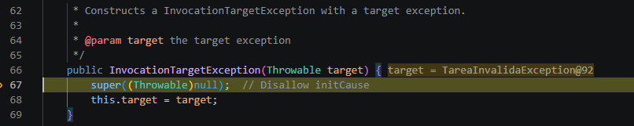
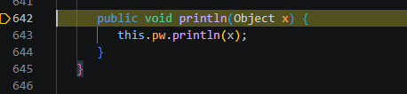

# Ejecucion Debugger

## BreakPoint en Controller

LLegamos a la exception

Y nos lleva a la carpeta de excepciones de java para poder realizar el proceso

Con esto obtiene y manda el mensaje obtenido

